<h1>CI5105</h1>
<h1>Programming II</h1>
<h1>Software Application Development Coursework (30%)</h1>
<h1>Java CV Management Application</h1>

# Coursework Brief

The main objective of this assignment is to provide students with hands-on experience in building a Java application featuring a Java Swing graphical user interface (GUI) and file input/output (I/O) capabilities. In addition, the application must satisfy a number of requirements or use-cases and these are detailed in full below.

To complete this project, you need to develop an application that enables users to manage Curriculum Vitae (CV) data. Users should be able to edit and update different sections of their CV as required, to simplify the creation of a Custom CV tailored to individual job applications.

The project is intended to enhance students' Java programming skills. It involves writing code to implement a data model, crafting Java Swing GUI code and developing code to thoroughly test various use-cases, including storing, managing, and retrieving CV data.

## Submission Details
 

We consider the CV to have the nine sections listed below. You are not being asked to build an application to handle all nine sections. You need to build an application that handles only the User section and another section, as per the table below.

  * The submission deadline: 18th April (Thursday of "revision week" just before exams start...)
  * The submission format: GitLab repository accompanied by a walk-through video submitted to Canvas drop box demonstrating and explaining the developed functionality.

Every student must do two sections. The User section is compulsory - everyone must do this. The second section is decided on the basis of the last digit of your K-number according to another table below.

Section|Component|Mandatory/Optional|
--|--|--|
User|Title|Mandatory|
| |Name|Mandatory|
| |Email|Mandatory|
Contact Information|Phone|Mandatory|
| |Address|Optional|
Core Competencies|Profile Statement|Mandatory|
||Skills|Optional|
Education|Certificate 1|Mandatory|
||Certificate 2|Optional|
Experience|Role 1|Mandatory|
||Role 2|Optional|
Training & Qualifications|Qualification 1|Mandatory|
||Qualification 2|Optional|
Projects & Interests|Interests List|Mandatory|
||Accomplishments List|Optional|
Publications|Reference Entry 1|Mandatory|
||Reference Entry 2|Optional|
References|Referee Contact Info 1|Mandatory|
||Referee 2 Contact Info|Optional|

 <code> Table 1. CV Sections and Components: For a particular Section, Components that are Mandatory must appear. Those that are optional might be included if selected</code>

A CV management system that supports the nine sections and the list of features we detail below, is quite a complex application. So, we decided to partition the application so that students build slightly different things.

<table>
<tr>
   <th style="width:3em">Knumber   ends with</th>
   <th style="width:20em">CV Sections required</th>
</tr>
<tr>
   <td style="text-align:center">0</td>
   <td><a href="#user">User</a>  and <a href="#contact-information">Contact Information</a></td>
</tr>
<tr>
   <td style="text-align:center">1</td>
   <td><a href="#user">User</a>  and <a href="#core-competencies">Core Competencies</a></td>
</tr>
<tr>
   <td style="text-align:center">2</td>
   <td><a href="#user">User</a>  and <a href="#core-competencies">Core Competencies</a></td>
</tr>
<tr>
   <td style="text-align:center">3</td>
   <td><a href="#user">User</a>  and <a href="#references">References</a></td>
</tr>
<tr>
   <td style="text-align:center">4</td>
   <td><a href="#user">User</a>  and <a href="#training-and-qualifications">Training  and  Qualifications</a></td>
</tr>
<tr>
   <td style="text-align:center">5</td>
   <td><a href="#user">User</a>  and <a href="#contact-information">Contact Information</a></td>
</tr>
<tr>
   <td style="text-align:center">6</td>
   <td><a href="#user">User</a>  and <a href="#education">Education</a></td>
</tr>
<tr>
   <td style="text-align:center">7</td>
   <td><a href="#user">User</a>  and <a href="#experience">Experience</a></td>
</tr>
<tr>
   <td style="text-align:center">8</td>
   <td><a href="#user">User</a>  and <a href="#projects-and-interests">Project  and  Interests</a></td>
</tr>
<tr>
   <td style="text-align:center">9</td>
   <td><a href="#user">User</a>  and <a href="#publications">Publications</a></td>
</tr>
</table>
 <code> Table 2. CV Sections that you should implement according to the last digit of your Kingston ID Number.<b>It is important that you follow this rubric.</b></code>

## Task Description

Consider this: We want to build an application to provide users with a comprehensive CV-building experience that goes beyond the conventional approach. A CV typically consists of various sections, such as User, Contact Information, Education, Experience, Skills, Interests, and more. However, our vision takes it a step further. We want to let users not only create their initial CV but also manage a repository where they can preserve and access 'choices' to customise these CV sections for different roles.

This approach makes it easier to produce a **customised CV**. Users can tailor their CVs to specific job positions by drawing from the repository and picking their most relevant data. This dynamic approach to CV management helps users prepare CVs for various opportunities with ease.

## Mock-ups of interface
The suggested look-and-feel of the application is shown below. 

Do note the following:
   * These diagrams were not screen-captures from an actual Java application, these were designed on a mock-up tool and your 'design' will inevitably be different.

### User

__In the User section__, the user may have several ways in which they present their name, title and email. 

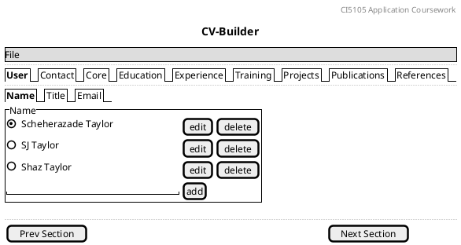

The past choices are there, they may be deleted or updated, or brand-new entries may be added, and once added, they join the list. There are radio buttons next to each choice. The user may pick only one choice from a list.

Note that the "Prev" and  "Next" buttons switch the user from one section to another. Switching between _Name_, _Title_ and _Email_ is done directly through the sub-section tabs. But for switching between the main sections, the user may use either the section tabs or the "Prev" and "Next" buttons.

Below is the detail for the _Title_ sub-section of _User_.
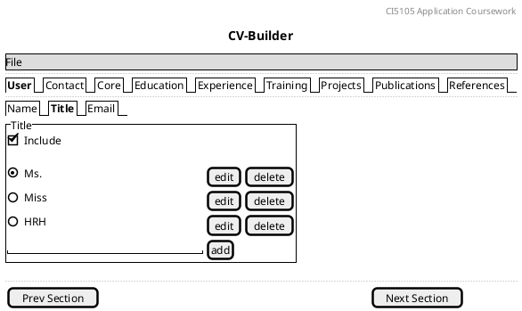

Note that there is an _include_ button. If the user does not tick the _include_ button, the information in the _Title_ sub-section will not be saved to the Custom CV.

Below is the detail of the _Email_ sub-section of _User_.

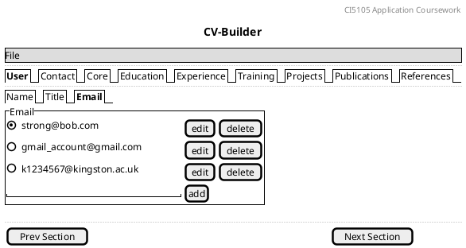

### [KUID0&5] Contact Information

__In the Contact Information section__, there are components: _Phone_ and _Address_. 

If the user clicks on the _Phone_ tab in the Contact Information screen, they see the screen below.

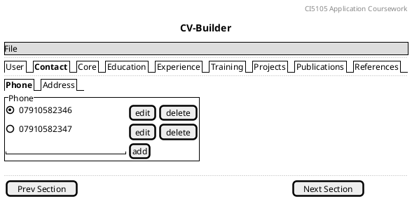

The user may edit/delete the choices for address entries, select from them, or add to them. Once done, they can move on to the _Address_ sub-section.

Below is the _Address_ detail of the _Contact Information_ section.

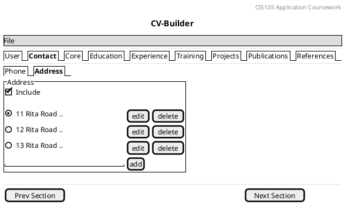

The user may edit/delete the choces for telephone entries, select from them, or add to them. The user has the option of including the Address information in the Custom CV or leaving it out, by ticking or un-ticking the _Include_ checkbox.

### [KUID1&2] Core Competencies
__In the Core Competencies section__ — displayed below, there are the components: _Profile Statement_ and _Skills_. The _Skills_ component is required: this means that any CV must have a Skills component. The user may wish to include the _Profile Statement_ by ticking the checkbox. 

In the _Profile Statement_ sub-section, the user may manage the entries and pick from the choices. They may edit/delete the choices of Profile Statements, select from them, and add to them. The user should also decide whether to include the profile statement as part of the Custom CV, with the default being to include it.

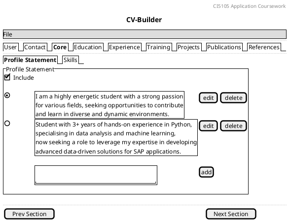

Below is the _Skills_ detail of the _Core Competencies_ section. Here, the user may manage the skills entries and select from the choices. They may edit/delete the choices of entries, select from them, and add to them. The user should also decide whether to include the skills statement as part of the Custom CV, with the default being to include it.

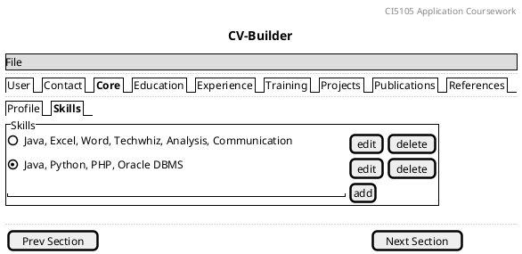

### [KUID6] Education

__In the Education section__ — displayed below, there are _Institution_ listings. Each educational institution the user attended has its sub-section (tab).

In the screen below, the user is viewing the _Institution 1_ sub-section. They may manage choices from the education section entries(degree or certificate) received at that institute. They can edit or delete existing entries, or add a new entry.

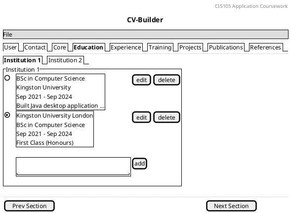

In the screen below, the user has clicked the _Institution 2_ tab and is able to edit/add different choices/selections.

Note that the user, from Institution 2 onwards, has a choice whether to include the data in that Institution in the Custom CV or not. In the screen below, the user ticked the _Include_ checkbox. 

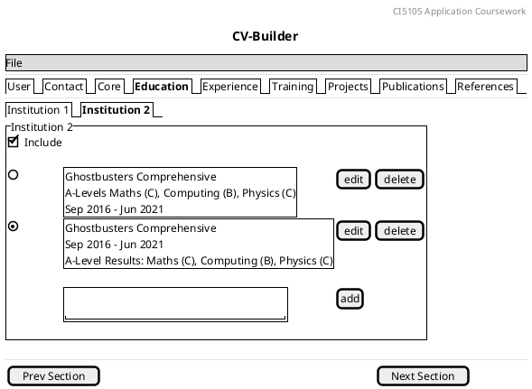

The _Institution_ component is typically several lines long; but it is stored as a whole; the institution name, start date, end date, description are stored separately. If the user wants to change one line and keep the other lines the same, they have to type the other lines again.

### [KUID7] Experience

__In the Experience section__ — displayed below, there are _Position_ listings. Each role or position the user had is contained by its respective sub-section (tab).

This section works very much like the Education section: the first Position is always mandatory (it will be used in the Custom CV), but subsequent positions are optional (so they have an Include checkbox).

In the screen below, the user has clicked the Position 2 sub-section and is able to edit/add different versions. 

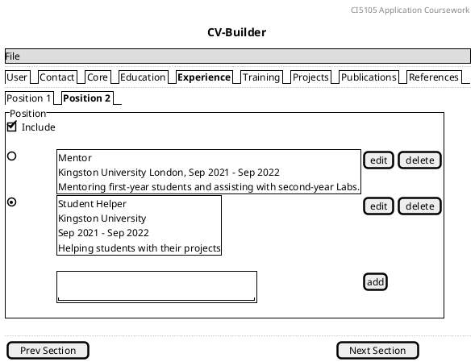

The Position 1 tab would be very similar in appearance but would not have an _Include_ checkbox.

The _Position_ component is typically several lines long; but it is stored as a whole; the position title, organisation name, start date, end date, description are stored separatekl.  If the user wants to change one line and keep the other lines the same, they have to type the other lines again.

### [KUID4] Training and Qualifications

__In the Training & Qualifications section__ — displayed below, there are _Training or Qualifications_ listings. Each training or qualification the user accomplished is contained in its respective sub-section (tab).

This section works very much like the Education and Experience sections: the first _Training or Qualification_ is always mandatory (it will be used in the Custom CV), but subsequent positions are optional (have an Include checkbox).

In the screen below, the user has clicked the second sub-section and is able to edit/add different versions. 

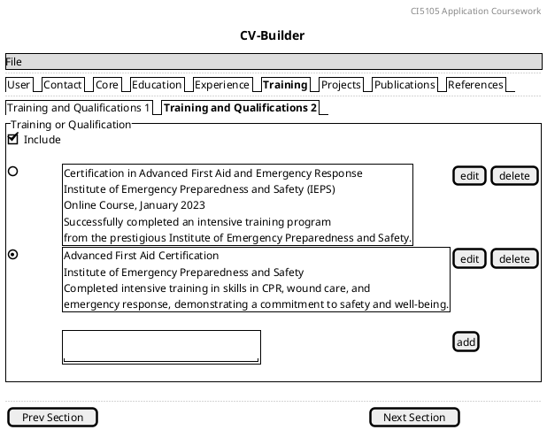

The first tab would be very similar in appearance but would not have an _Include_ checkbox.

The _Training or Qualification_ component is typically several lines long; but it is stored as a whole; the training or qualification title, organisation name, start date, end date, description are stored sparately.  If the user wants to change one line and keep the other lines the same, they have to type the other lines again.

### [KUID8] Projects and Interests

__In the Projects & Interests section__ — displayed below, there are _Project or Interest_ data. Each project or list of interests that the user records is contained in its respective sub-section (tab).

This section works very much like the Education, Experience and Training & Qualifications sections: the first _Project or Interest_ is always mandatory (it will be used in the Custom CV), but subsequent records are optional (have an Include checkbox).

In the screen below, the user has clicked the second sub-section and is able to edit/add different versions. 

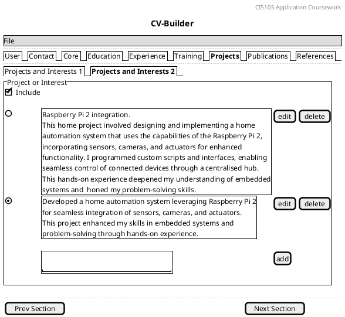

The first tab would be very similar in appearance but would not have an _Include_ checkbox.

The _Project or Interest_ component is typically several lines long; but it is stored as a whole; the specifics of the description are stored individually.  If the user wants to change one line and keep the other lines the same, they have to type the other lines again.

### [KUID9] Publications

__In the Publications section__ — displayed below, there are _Publication_ data. Each publication that the user records is contained in its respective sub-section (tab).

This section has no mandatory sub-sections. This means that unless the user ticks the Include tickbox, publications information will not be used in the Custom CV. All records are optional (have an Include checkbox).

In the screen below, the user has clicked the sub-section for the first entry and is able to edit/add different versions. 

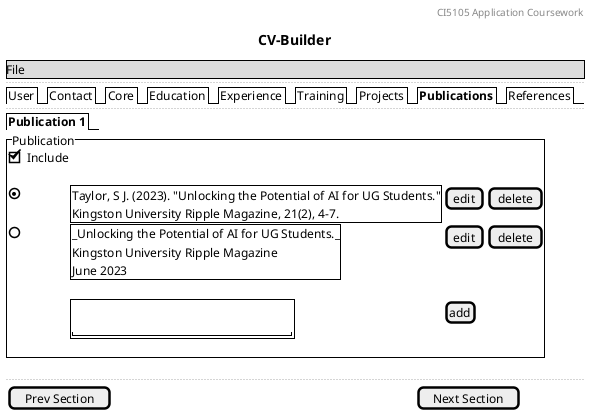

The _Publication_ sub-section is typically several lines long; but it is stored as a whole; the specifics of the publication details are stored individually.  If the user wants to change one line and keep the other lines the same, they have to type the other lines again.

### [KUID3] References

__In the References section__ — displayed below, there are _Referee_ entries. Each referee that the user records is contained in its respective sub-section (tab).

This section has no mandatory sub-sections. This means that unless the user ticks the Include tickbox, refereee information will not be used in the Custom CV. All sub-tabs are optional (have an Include checkbox).

In the screen below, the user has clicked the sub-section for the first entry and is able to edit/add different versions.

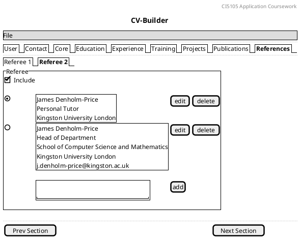

The _Referee_ sub-section is typically several lines long; but it is versioned as a whole; the specifics of the referee (organisation, position, email, etc) are not versioned.  If the user wants to change one line and keep the other lines the same, they have to type the other lines again.

---
### Key use cases
The main use cases that your Java application should demonstrate are:
- The user is able to enter data to populate __two__ CV sections (the two sections, of the nine, are allocated on the basis of the last digit of your k-number).
- The user is able to maintain the set of choices of each CV section (edit & delete).
- The user is able to load the repository of CV data from a file/files (covering both of your two sections).
- The user is able to make changes to the CV data and subsequently store the new data to a repository file(s).
- The user is able to select from the various history/choices of each section to craft a Custom CV.
- The user is able to store the contents of the Custom CV to a file.
- The user is able to print to console the contents of the Custom CV.
- The user is able to interact with an attractive, organised graphical interface.

Further details are provided below.

## Technical Requirements
   1. Implement the application using Java.
   1. Implement a graphical user interface (GUI) using Java Swing.
   1. Use the software development techniques and patterns that we taught, including Gitlab.
   1. Do NOT use a code generator of any sort, that includes NO GUI builders, no generated code off an AI engine, etc.

Any deviation from these guidelines automatically opens questions that will very likely necessitate a viva with the student, in person, before a mark can be given.
   
## Detailed breakdown of requirements

Here are detailed sub-tasks for the main tasks outlined above:

### ==Data Entry and Population==

For each of your two CV sections:

- [must] Create data entry forms for users to input the section information, broadly following the designs shown in the mock-ups, for the two sections.
- [should] Provide a user-friendly interface for easy data input.
- [could] Implement data validation to ensure that the entered information is accurate and complete.
   

### ==Maintenance of Choices==

For each of your two CV sections:

- [must] Implement options for each CV section so that users can select from the set of choices.
- [must] Allow users to view and select from a set of CV sections.
- [should] Allow users to load from a file a repository of data for each of the sections.
- [could] Allow users to save to a file a new repository containing all the data in the various sections.
- [could] Ensure data persistence so that user data remains intact across application sessions via the repository.

As envisioned in the UI seen above (which you do not have to stick to, but can design your own UI), the key thing is to let the user see and select from a set of choices within the various CV sections, and to let them add new choices. In this way, the 'versioning' or creation of choices/history is useful and doesn't get too much in the way.

### ==CV Storage and Display==

For each of your two CV sections:

  - [must] Allow users to print the contents of a Custom CV to the console (the Custom CV will be restricted to your two sections only)
  - [should] Format the printed output in a clear and organised manner for easy readability.
  - [should] Enable users to save the contents of the Custom CV (i.e, the versions picked in each section by the user) to a formatted file for later retrieval.
  - [could] Provide options for users to select which parts of the CV to print (this applies to section that have "include" tick-boxes).
  
### ==User Interface Design==

For each of your two CV sections:

   - [should] Design an attractive, user-friendly graphical user interface (GUI) that provides an organised layout for data entry and retrieval.
   - [should] Ensure that the GUI is intuitive and easy to navigate.

### ==CV Editing and Deletion==

For each of your two CV sections:

   - [should] Implement the ability for users to edit and delete choices from the "history" (past entries) of the two sections.

The above sub-tasks provide a comprehensive breakdown of the main tasks for creating the Java CV management application. Students should focus on addressing these sub-tasks to meet the assignment's requirements effectively.

## Deliverables  
   1. Well-documented Java source code for the application – that you wrote yourself — with a history of Gitlab commits.
   1. A recorded demo (walk-through) explaining how the app works, including code implementation, design choices etc.
   
## Assessment Criteria   

The [must/should/could] criteria above will be assessed for each of the two CV sections assigned (as per your KU ID last digit).
- For a pass (40-50) the demo must show the application, explaining the core code, which implements at least the [must-haves] for both sections.
- For a B/C (50-70) the demo must show the application, explaining the core code, which implements at least the [must-haves] and [should-haves] for both sections.
- For an A (>70) the demo must show the application and discuss design choices made whilst writing the code, which implements all [must-haves], all [should-haves] and the majority of [could-haves].

  
## Feedback and Assessment

The practical experience gained from this project aligns with the module's intended learning outcomes, which encompass designing and implementing a data model, creating a user-friendly GUI, and rigorously testing the application. Furthermore, this project serves as a useful exercise, reminding students to prepare their CVs for potential placement or full-time job opportunities. Upon completion, you will have your own CV management system and the ability to claim this accomplishment on your CV!

## Late Submission and Plagiarism

The code and demo must be yours, evidenced by meaningful Gitlab commits. Code that is not well-explained, or is "3rd party" without clear & justifiable reference/origin, may need to be viva'd in-person during the exam period (so make sure your demo, explanation and documentation - comments in the code and Gitlab - are clear and comprehensive).

There is a University-mandated "24h grace period" after the deadline for "IT issues" i.e. you should have finished the work by the deadline and not need the grace period other than for exceptional circumstances (such as Canvas uploads failing etc.) Work that is even 1 minute after the grace period expires will be "late". Work that is "late" but within 5 working days of the deadline will be capped at 40% ("late-capped"), after that work is "too late" and will not be marked. If you need to submit after the deadline (after the drop box on Canvas has closed), contact the module leader for the mechanism (obviously your code will be on Gitlab but your demo will need to be submitted to Canvas for a "late-capped" mark).

<strong style="background:yellow; color:black;">Test your work after you submit!</strong> Every year there is at least one person who claims "they submitted the 'old' version by mistake" or "the video was corrupt" as an excuse for the work not being assessable -- such work cannot be marked. Testing (by downloading it from Canvas and running it yourself) is so easy ... please don't forget to <strong style="background:yellow; color:black; text-transform: uppercase;">test your work!</strong>

